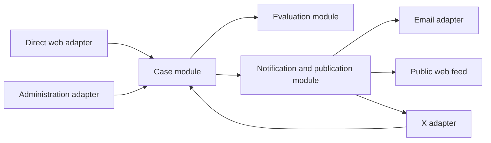

# Settle a Bet V1 Product Specification

Status: Draft for team review

The v1 product definition is agreed, but the team has not chosen whether direct web initiation or X-assisted initiation should be delivered first. Both paths are specified here and share the same Case workflow.

## Product promise

Settle a Bet gives friends, small social groups, and internet strangers a procedurally fair way to settle voluntary, low-stakes subjective disagreements. Participants submit sealed Positions and context. A heterogeneous panel of AI Judges independently researches the merits of those Positions, casts auditable Votes, and produces an anonymized public Judgment.

The product promises an independent panel and a consistent process. It does not promise that any model is unbiased, objectively correct, or suitable for consequential decisions.

## Goals

- Turn an informal disagreement into a clear, mutually accepted Decision Frame.
- Judge the merits of Positions rather than participants' writing or debating skill.
- Research and steelman every Position symmetrically.
- Make the resulting Verdict mechanically determined and inspectable.
- Produce a useful, shareable public Judgment.
- Support direct web and X-assisted initiation through one Case workflow.
- Measure whether all sides, especially non-prevailing Participants, felt the process was fair.

## Non-goals

- Holding wagers, charging fees, authorizing cards, or paying winners.
- Objective fact-checking as the primary product.
- High-stakes medical, legal, financial, employment, safety, or reputational decisions.
- Accusations about identifiable people or decisions affecting non-consenting people.
- Rebuttal rounds or appeals.
- Private Judgments.
- Public comments, reactions, profiles, rankings, or algorithmic feed ranking.
- File, image, audio, video, or PDF evidence uploads.
- Verifying Reddit or X identities for ordinary web-originated Cases.

## Audience and scope

V1 serves 2 to 4 Participants, including the Creator. Typical Cases originate in an in-person conversation, group chat, Reddit thread, or X conversation. Participation is voluntary, and submitting constitutes acceptance of the exact Decision Frame and public publication terms.

V1 is limited to relatively low-stakes debates and opinions. A Case is Ineligible when a substantive Judgment could materially affect someone's safety, rights, reputation, health, finances, or livelihood, or when meaningful anonymization is impossible.

## Shared Case lifecycle

### 1. Frame the Case

The Creator enters an informal question or premise and selects a total Participant count from 2 to 4.

A framing assistant proposes a Decision Frame containing:

- The precise question to decide
- Defined terms and scope
- The judging standard
- Important assumptions
- Explicit exclusions

The Creator may edit the proposal and must approve the final Decision Frame. The framing assistant never changes it silently.

### 2. Commit the Creator

Before invitations are available, the Creator must:

- Verify an email address
- State one concise Position
- Enter a sealed Submission
- Confirm the Decision Frame and publication terms

Voice input is a drafting aid only. The Creator receives an editable transcript and ultimately submits text. Raw audio is not sent to Judges and should be deleted after transcription or abandonment of the draft.

### 3. Invite Participants

The Case receives bearer invitation links for its remaining slots. An invitee verifies an email address through a magic link, claims a slot, reviews the Decision Frame, and submits a sealed Position and Submission.

No account or password is required. Social identity verification is outside the ordinary web flow.

Positions and Submissions are hidden from every other Participant until the Case locks. A Participant may revise or withdraw while the Case remains open. The latest confirmed version is authoritative.

### 4. Lock or expire

The Case locks immediately when every expected Participant has submitted. The Decision Frame, Positions, and Submissions then become immutable.

The default submission deadline is 72 hours. If the roster is incomplete at the deadline:

- The Case expires without evaluation.
- Sealed content remains private.
- The Creator may start a new Case with a different roster.

The platform never silently removes a missing Participant and evaluates a different roster.

### 5. Perform Sincerity Review

Every locked Case enters a private approval queue. An authorized approver may inspect the Decision Frame, all Positions, all Submissions, sources, and automated safety signals.

The review asks whether the Case contains sincere attempts to address the Decision Frame rather than spam, trolling, nonsense, or junk. Argument strength is not an approval criterion.

The approver may approve or reject but cannot edit any Case content. The detailed moderation policy remains operator discretion rather than application logic.

A Rejected Case:

- Receives a private status and reason visible to its Participants
- Triggers participant email notifications
- Is never evaluated, published, or added to the public feed
- Does not create a public moderation record

Authorized human access is disclosed in the governing Terms and Privacy Policy, but the product flow need not describe the internal approval queue.

### 6. Evaluate

Approval starts the automated evaluation workflow. The target is approximately 10 to 30 minutes, with up to one hour considered acceptable during beta. The Case page shows stable progress stages without streaming provisional conclusions.

The evaluation workflow is:

1. A Position Mapper preserves every original Position and groups materially equivalent Positions.
2. One Position Researcher per normalized Position builds its strongest case, researches relevant public sources, and records weaknesses.
3. A Cross-Examiner compares the research, challenges unsupported claims, and identifies unresolved conflicts.
4. The combined output becomes the shared Research Record.
5. Three Judges receive the same Decision Frame, anonymized Submissions, Position Map, and Research Record.
6. Each Judge performs additional independent web research and reasoning without seeing another Judge's output.
7. Each Judge submits one sealed Vote and one Judicial Opinion.
8. The aggregator mechanically determines the Verdict.
9. The Synthesizer explains the locked result without changing it.

Participant Submissions are untrusted evidence, never system instructions. Submitted pages and retrieved web content must also be treated as untrusted input.

### 7. Aggregate the Verdict

Each Judge may Vote for:

- One normalized Position
- No Material Disagreement
- No Submitted Position Prevails
- Indeterminate

Two matching Votes determine the Verdict. A Position Prevails only when two Judges select the same normalized Position. If no two valid Votes align, the Verdict is Indeterminate.

Confidence scores and prose do not override the Votes. The Synthesizer is not a fourth Judge or tie-breaker.

### 8. Handle Judge failure

The Judge Panel is selected automatically at evaluation time under one product-wide Panel Policy. An approver cannot tailor the panel to an individual Case.

If a selected Judge suffers an API error or returns malformed output:

- Retry the same selected model with the same configuration.
- Do not silently substitute a different model after evaluation begins.
- Record every retry and failure.

A substantive Indeterminate Vote is valid. A technical failure is not. If all three valid Votes cannot be obtained within the evaluation deadline, the Case becomes Evaluation Failed and receives no substantive Verdict.

### 9. Publish

Every completed Judgment is public and appears in a basic reverse-chronological feed. V1 does not provide a private option.

Before publication, the system redacts:

- Email addresses and phone numbers
- Postal or exact physical addresses
- Account handles
- Participant names
- Identifying details about Participants or non-consenting third parties

Redactions are visibly marked rather than silently rewritten. If redaction would destroy the meaning of the Case, the Case is Ineligible and is not published.

Published Judgments are immutable. Additional redactions or administrative takedowns may hide content with a visible notice, but they do not rewrite the Verdict. A future appeal would create a linked Judgment rather than overwrite the original; appeals are not part of v1.

## Verdict and Judgment presentation

The Judgment page should prioritize:

1. A concise Verdict and winning Position, when one prevails
2. The Synthesizer's majority explanation
3. The original anonymized Positions and Submissions
4. The Position Map
5. The Research Record and citations
6. Each Judge's Vote and Judicial Opinion
7. Dissent and uncertainty
8. The expandable Transparency Record

Each Judicial Opinion includes:

- Interpretation of the Decision Frame and Positions
- Decisive considerations
- Strongest supporting evidence and citations
- Strongest counterarguments
- Uncertainty and limitations
- The Judge's Vote

The product publishes every provider-returned reasoning artifact it is permitted to show. Artifacts must be labeled accurately as raw reasoning, summarized reasoning, encrypted or unavailable reasoning, or a requested Judicial Opinion. The product must never manufacture a narrative and label it raw chain of thought.

## Transparency Record

The completed Judgment discloses:

- Exact model providers, identifiers, and versions
- Model and tool configurations
- System instructions, judging rubric, and prompt versions
- Anonymized model-visible inputs
- Search queries, retrieved sources, citations, and retrieval times
- Provider-returned outputs and available reasoning artifacts
- API response identifiers and timestamps where available
- Retries, failures, and substitutions
- Aggregation-policy version and the three locked Votes

The public Transparency Record does not include Sincerity Review approval activity. Approval and rejection actions should remain in a private operational audit record.

## Initiation path A: direct web

The direct web adapter begins on the product website:

1. The Creator selects "Create a Case."
2. The website guides framing and Creator submission.
3. The website issues invitation links.
4. Invitees complete the shared web participation flow.
5. Participants receive status and result emails.
6. The public Judgment and feed are web-hosted.

The web experience also includes:

- Public feed
- Public Judgment pages
- Participant status pages
- Authenticated resume links
- Private feedback capture
- Administrative Sincerity Review queue
- Evaluation operations and failure inspection

## Initiation path B: X-assisted web

The X adapter begins in an existing public X conversation:

1. A user mentions the product's X account and identifies intended Participants.
2. The X adapter receives the mention through the official X API.
3. The bot sends one public acknowledgment asking the Creator to initiate a DM.
4. After the Creator DMs the bot, it returns a signed setup link tied to the originating post.
5. The Creator completes the standard web framing and Submission flow.
6. Intended Participants initiate a DM with the bot or receive a web invitation from the Creator.
7. Every Participant completes the standard web Position and Submission form.
8. The shared Case lifecycle runs unchanged.
9. The bot quote-posts the originating conversation with a concise Verdict and public Judgment link.

An additional in-thread result reply is best-effort and must comply with X automation policy. The canonical automated result post is the quote post.

X-originated Cases are anonymized on the Judgment page, but posting back to the originating public conversation can contextually identify Participants. The web submission confirmation must make this channel-specific publication behavior clear.

The X adapter must use the official API and respect current automation, DM, reply, rate-limit, and paid-access requirements. It must not use scraping or browser automation. A valid X username contains only letters, numbers, and underscores and is at most 15 characters; a handle such as `@SettleABet` is structurally valid if available.

## Shared architecture

The application has one deep Case module with a channel-neutral interface. The module owns:

- Decision Frame approval
- Participant capacity and slot claims
- Position and Submission revision
- Case Lock and expiration
- Sincerity Review transitions
- Evaluation orchestration
- Vote aggregation
- Verdict and Judgment publication
- Feedback eligibility

The web, X, and administration experiences are adapters at the Case module seam. They translate channel-specific input into Case operations and present returned state, but they do not implement lifecycle rules.

True external dependencies sit behind internal seams with production and test adapters:

- AI model providers
- Web search and retrieval
- Email delivery
- Voice transcription
- X

Tests should exercise Case behavior through the same interface used by adapters. Model, search, email, transcription, and X tests use controlled adapters so lifecycle behavior does not depend on live external systems.

The existing Stripe template code is not part of v1 product behavior. Payment and wager concepts must not enter the Case module until a later legal, operational, and payment-provider design is approved.

## Input limits

Initial configurable limits are:

- 5,000 words per Submission
- 10 submitted public URLs per Participant
- 15 minutes per voice recording
- 2 to 4 Participants per Case
- 72 hours to complete the roster

These are operational defaults, not permanent domain invariants.

## Notifications

Email notifications should cover:

- Email verification and participant-slot claim
- Submission confirmation
- Deadline reminder
- Case expiration
- Case rejection and private reason
- Evaluation start
- Judgment publication
- Evaluation failure
- Fairness-feedback request and one reminder

X-assisted Cases may send equivalent status DMs only after the user has initiated a DM and only where platform policy permits.

## Feedback and success measurement

After publication, each Participant receives a private one-click question asking whether the process felt fair, followed by an optional comment. Send one reminder after 24 hours to non-responders.

Participant feedback is not displayed on the public Judgment.

The primary success metric is the percentage of completed Cases where:

- A majority of responding Participants rate the process as fair, and
- At least one Participant whose Position did not prevail rates the process as fair

Secondary metrics include:

- Invitation claim rate
- Roster completion rate
- Approval and rejection rates
- Evaluation completion and failure rates
- Median time from approval to Judgment
- Repeat Case creation
- Judgment visits and shares

## Security, privacy, and abuse requirements

- Keep participant emails separate from public Judgment content.
- Use high-entropy, expiring magic links and invitation tokens.
- Prevent one verified email from claiming multiple slots in the same Case.
- Rate-limit creation, verification, transcription, invitation claims, and public endpoints even though product-level Case creation is unlimited.
- Treat Submissions, URLs, retrieved pages, and X payloads as untrusted input.
- Defend model prompts and tools against prompt injection.
- Never expose model-provider credentials or private operational records.
- Record administrative reads and moderation actions privately.
- Preserve an auditable link between original content, redacted public content, and published citations.
- Provide reporting and takedown paths for privacy or safety issues.

## Acceptance criteria

The shared Case workflow is ready when:

- A 2-to-4-person Case can be framed, joined, revised, locked, reviewed, evaluated, and published.
- No Participant can inspect another sealed Position or Submission before Case Lock.
- Rejected and expired Cases never reach model providers or the public feed.
- Equivalent Positions can be grouped without losing original wording.
- Every normalized Position receives equal research resources.
- Each Judge researches and Votes independently.
- Two matching Votes mechanically determine the Verdict.
- The Synthesizer cannot alter the Verdict.
- Evaluation failure cannot be mistaken for Indeterminate.
- Published content is anonymized and visibly redacted.
- The Judgment exposes the required provenance and available reasoning artifacts.
- Automated feedback is private and attributable to the Participant's outcome.

The direct web path is ready when a Creator can initiate the full workflow without X.

The X-assisted path is ready when a valid mention can create a secure handoff into the same web workflow and the completed Judgment can be posted back through the official X API.

## Initiation-path sequencing

Both initiation paths require the channel-independent Case module, web-based framing and Submission forms, administrative review, evaluation workflow, public Judgment pages, and public feed. The sequencing decision concerns which Creator acquisition path is completed and validated first.

| Option | What is prioritized | Advantages | Risks |
| --- | --- | --- | --- |
| Direct web first | Website creation, email invitations, and direct sharing | Fewer external dependencies; validates the complete Case workflow directly; simpler debugging and testing | Distribution must be created outside the product; may under-test the social-thread use case |
| X-assisted first | Mention detection, DM handoff, thread-linked creation, and result posting | Tests the strongest distribution loop and the internet-stranger use case early | Still requires the shared web forms; adds paid API, policy, webhook, rate-limit, and account-suspension dependencies |

The team should choose using four criteria:

- Which acquisition hypothesis is most important to validate first
- Whether approved X API access and budget are available
- Whether the team wants external-platform risk on the first critical path
- Whether early testers will primarily arrive through direct invitations or public social debates

## Open decisions

- Which initiation path is delivered first
- Final product name and X handle
- The internal Panel Policy's initial providers and model-selection rules
- Exact model, search, and reasoning budgets
- Submission-deadline configuration beyond the 72-hour default
- Sincerity Review operating guidelines and staffing
- The threshold for moving from manual approval to more automated moderation
- Whether future versions add private Cases, larger rosters, rebuttals, or appeals
- Whether and how a legally compliant wager and payout capability is introduced

## External platform constraints

- [X API overview](https://docs.x.com/x-api/overview)
- [X developer automation guidelines](https://docs.x.com/developer-guidelines)
- [X Account Activity API](https://docs.x.com/x-api/account-activity/introduction)
- [X username rules](https://help.x.com/en/managing-your-account/x-username-rules)
- [OpenAI on hidden chain of thought](https://openai.com/index/learning-to-reason-with-llms/)
- [Claude extended thinking](https://platform.claude.com/docs/en/docs/build-with-claude/extended-thinking)
- [xAI reasoning documentation](https://docs.x.ai/developers/model-capabilities/text/reasoning)
